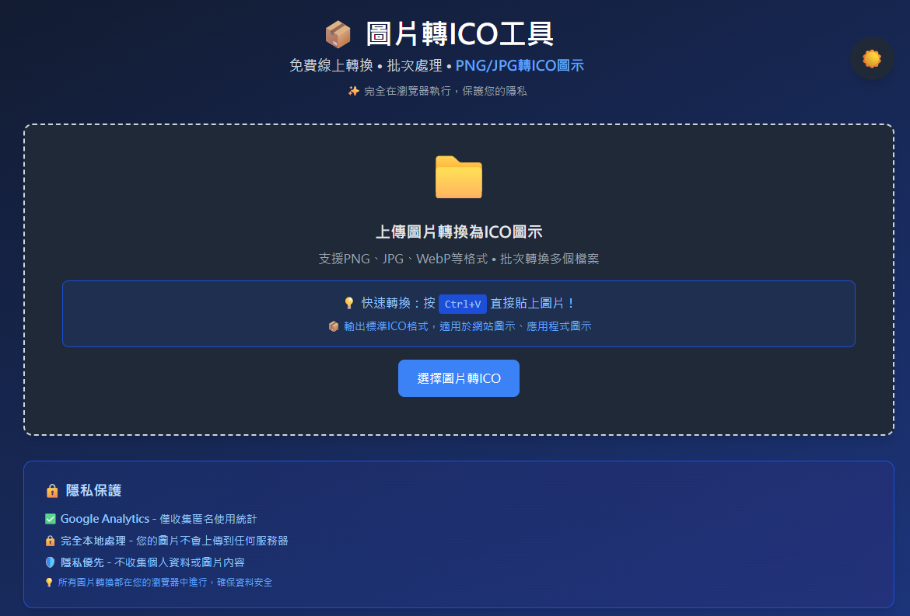

# Advanced Image Converter｜免費線上圖片轉ICO工具（支援批次處理、PNG/JPG/WebP/GIF互轉）

一款輕量級、免安裝的圖片格式轉換工具，採用純 HTML、CSS、JavaScript 製作，直接在瀏覽器中執行，支援多種圖片格式互轉，快速生成 ICO 圖示，適合設計師、前端開發者與一般使用者。

## 🔧 功能特色

- **拖曳上傳**：支援拖放圖片至瀏覽器，快速載入。
- **多格式支援**：可轉換 JPEG、PNG、WebP、GIF、BMP、TIFF、SVG 等格式。
- **ICO 圖示生成**：一鍵將 PNG/JPG 轉換為 ICO，適用於 favicon 或桌面應用。
- **批次處理**：可同時轉換多張圖片，節省時間。
- **免安裝使用**：純前端架構，無需下載或安裝任何軟體。
- **使用者友好介面**：簡潔直覺的操作流程，零學習成本。

## 🚀 使用方式

1. 開啟 [Advanced Image Converter 網頁版](https://sid-1996.github.io/Advanced-Image-Converter/)。
2. 將圖片拖曳至指定區域或點擊上傳。
3. 選擇欲輸出的格式（如 ICO、PNG、JPG 等）。
4. 點擊「Convert」開始轉換。
5. 轉換完成後即可下載圖片。

## 📁 支援格式

- **輸入格式**：JPEG、PNG、WebP、GIF、BMP、TIFF、SVG  
- **輸出格式**：ICO、JPEG、PNG、WebP、GIF、BMP、TIFF、SVG

## 🖼️ 範例圖示

## 📜 授權方式

本專案採用 [MIT License](https://opensource.org/licenses/MIT)，歡迎自由使用、修改與分發。

---

# Advanced Image Converter｜Free Online Image to ICO Converter (Batch Support • PNG/JPG/WebP/GIF to ICO)

A lightweight, browser-based image format converter built with pure HTML, CSS, and JavaScript. No installation required. Supports multiple formats and fast ICO generation. Ideal for designers, developers, and everyday users.

## 🔧 Features

- **Drag & Drop Upload**: Easily add images by dragging them into the browser.
- **Multi-format Support**: Convert JPEG, PNG, WebP, GIF, BMP, TIFF, SVG and more.
- **ICO Generation**: Instantly convert PNG/JPG to ICO for favicons or desktop apps.
- **Batch Conversion**: Convert multiple images at once to save time.
- **No Installation Needed**: Runs entirely in the browser—no software required.
- **User-Friendly Interface**: Clean and intuitive UI for effortless operation.

## 🚀 How to Use

1. Visit the [Advanced Image Converter Web App](https://sid-1996.github.io/Advanced-Image-Converter/).
2. Drag and drop your image files into the upload area.
3. Choose your desired output format (e.g., ICO, PNG, JPG).
4. Click the “Convert” button to start.
5. Download the converted images once complete.

## 📁 Supported Formats

- **Input**: JPEG, PNG, WebP, GIF, BMP, TIFF, SVG  
- **Output**: ICO, JPEG, PNG, WebP, GIF, BMP, TIFF, SVG

## 🖼️ Example Screenshot

## 📜 License

This project is licensed under the [MIT License](https://opensource.org/licenses/MIT). Feel free to use, modify, and distribute.

---

## ☕ 支持作者  

  

[🔗 Support This Project](https://www.paypal.com/ncp/payment/4YCFVARX3ADGW](https://www.paypal.com/ncp/payment/GJS4D5VTSVWG4))  

[💚 綠界科技贊助（支持作者）](https://p.ecpay.com.tw/E0E3A)  

  
感謝每一位支持者！💖
